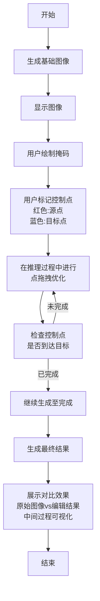
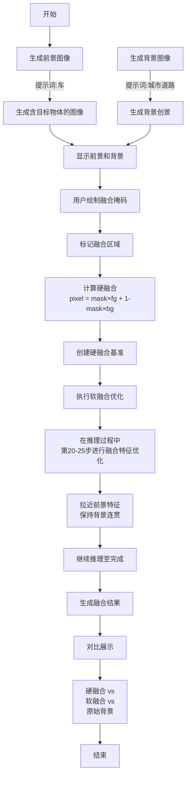
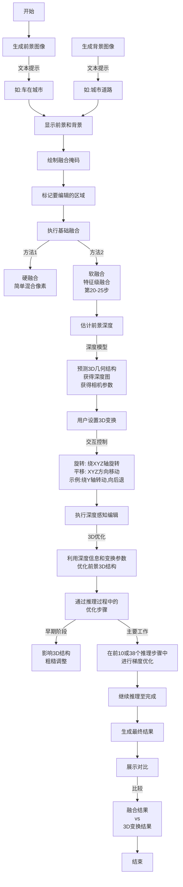

# FlowDLE 工作流程图

## 1. drag.ipynb - 拖拽编辑流程

### 整体流程


### 核心逻辑

**拖拽编辑原理:**
- 在图像生成过程中的某个步骤中断
- 在中断点优化内部特征，使指定的源点移动到目标点
- 然后继续完成生成过程

**三个关键时刻:**
1. **拖拽点**: 在第3步时进行优化操作
2. **优化过程**: 90次迭代，使控制点逐步移向目标位置
3. **结果合成**: 从第3步继续生成到第50步得到最终图像

---

## 2. transfer.ipynb - 图像融合流程

### 整体流程


### 核心逻辑

**融合策略对比:**

| 方式 | 过程 | 效果 |
|-----|-----|------|
| **硬融合** | 在像素级直接混合两张图像 | 边界清晰但可能不协调 |
| **软融合** | 在推理中期进行特征级优化 | 保证物理一致性，融合平衡 |

**软融合优化:**
- 提取前景的特征信息
- 在背景生成过程中逐步融合这些特征
- 只在关键时刻（第20-25步）进行优化
- 让后续推理自然完成细节合成


---

## 3. rotate.ipynb - 3D 变换和深度感知编辑

### 整体流程


### 核心逻辑

**三阶段编辑流程:**

**第一阶段 - 前景融合**
- 生成含目标物体的前景图像
- 使用掩码限制编辑范围
- 将前景融合到背景中

**第二阶段 - 深度估计**
- 分析前景图像的3D结构
- 获得：深度图、相机内参等信息
- 为3D变换做准备

**第三阶段 - 3D变换**
- 用户指定旋转和平移参数
- 系统利用深度信息重新投影
- 在推理过程中优化，保持一致性
- 生成变换后的结果


---

## 工作流程对比

| 功能 | drag.ipynb | transfer.ipynb | rotate.ipynb |
|-----|-----------|----------------|-------------|
| **目标** | 通过点拖拽移动物体 | 融合两张图像 | 旋转和平移3D物体 |
| **用户输入** | 掩码 + 控制点对 | 掩码 | 掩码 + 3D参数 |
| **关键技术** | 优化控制点位置 | 特征匹配融合 | 深度感知变换 |
| **处理时机** | 推理第3步进行优化 | 推理第20-25步优化 | 推理全过程优化 |
| **输出** | 拖拽结果 + 优化过程 | 融合结果对比 | 3D变换结果 |

---

## 典型应用组合

### 场景1: 单物体编辑
```
drag.ipynb
    ↓ (微调物体位置)
    ↓ 最终效果
```

### 场景2: 前景融合
```
transfer.ipynb
    ↓ (硬融合 → 软融合)
    ↓ 最终融合图像
```

### 场景3: 3D场景构建
```
transfer.ipynb (融合物体)
    ↓
rotate.ipynb (调整3D视角)
    ↓
drag.ipynb (精细调整位置)
    ↓
最终合成场景
```

---

## 所有流程的共同特点

✅ **基于AI图像生成** - 利用RectifiedFlow模型  
✅ **交互式编辑** - 用户通过UI指定编辑参数  
✅ **推理过程中优化** - 在生成过程中穿插优化步骤  
✅ **掩码驱动** - 多数流程用掩码限制编辑范围  
✅ **对比可视化** - 显示编辑前后的效果  
✅ **支持多步验证** - 优化过程和中间结果都可查看

