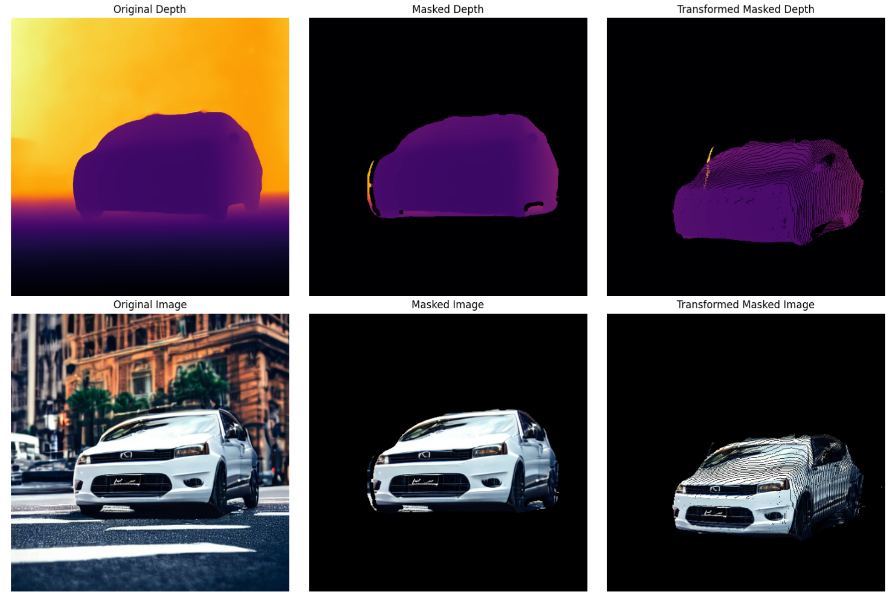

# 🌊 FlowDLE-Depth

### Depth-Aware Differentiable Latent Editing on Flow Models

<p align="center">


</p>




## ✨ Overview

**FlowDLE-Depth** introduces **Depth-Aware Latent Editing** for rectified flow models.

Instead of flat pixel blending, this method:

* 🧠 Incorporates monocular depth estimation
* 🎯 Applies masked latent optimization
* 🏗 Preserves 3D geometric structure
* 🛡 Maintains background feature consistency

The editing happens **directly on the rectified flow latent trajectory**, enabling structure-consistent modifications.

## 🔥 Key Features

* Depth-aware masked editing
* Differentiable latent optimization during inference
* Dual-loss design (foreground alignment + background preservation)
* Geometry-consistent transformations
* Multiple baseline comparisons

## 🧩 Method Pipeline

### 1️⃣ Depth Extraction

We compute:

* Original depth
* Masked depth
* Transformed masked depth (structure-aware projection)

Depth acts as a geometric constraint during editing.

### 2️⃣ Masked Latent Optimization

At selected flow timesteps:

**Foreground Loss**

* Feature alignment (masked region)
* Optional depth alignment

**Background Loss**

* Preserve unmasked features
* Prevent global drift

Loss is computed on intermediate UNet features (L1).

CFG batches use the conditional branch.

### 3️⃣ Depth-Aware Constraint

The depth map is:

* Masked
* Normalized
* Optionally transformed to pseudo-3D coordinates

This ensures edits follow object geometry instead of flat blending.


## 🚀 Quick Start

Install dependencies
```
pip install -r requirements.txt
git clone https://github.com/lpiccinelli-eth/UniDepth
cd UniDepth
pip install -e .
```

Run the following notebooks:

```
drag.ipynb --- for dragging
transfer.ipynb --- for transfer + blending
rotate.ipynb --- for rotation
```

Workflow:

1. Generate initial image with feature capture
2. Paint mask
3. Extract depth
4. Run depth-aware optimization
5. Compare with baselines

## 🎯 Editing Variants

| Method                       | Description                        |
| ---------------------------- | ---------------------------------- |
| **Depth-Aware Optimization** | Main method                        |
| Feature-Guided Optimization  | Feature alignment only             |
| Hard Blend                   | Mask-based blending                |

## 🧪 Results

The framework enables:

* Geometry-consistent foreground edits
* Reduced background artifacts
* Stable latent trajectory optimization
* Structured deformation

## 📚 Acknowledgements

Built on:
- InstaFlow
- UniDepth3D
- ipywidgets

We thank the authors of these projects for their foundational contributions.

## 📄 License

This project is licensed under the Apache License 2.0.

See the LICENSE file for full details.